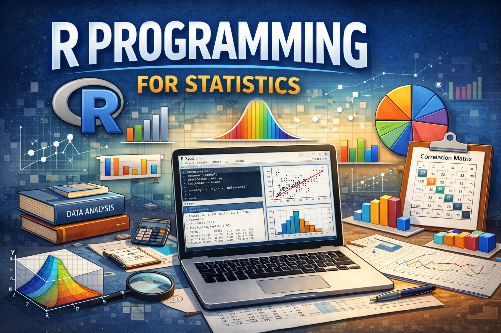

# R Programming for Statistics and Machine Learning

## Instructors

- Dr. Nikolay Oskolkov, Metabolic Research Group Leader, LIOS, Riga, Latvia
- Dr. Daniel Rivas, postdoctoral fellow in Metabolic Research Group, LIOS, Riga, Latvia

## Course overview
This course is designed for participants who are at beginner-level or have basic familiarity with R and are ready to advance their programming and computational data-analysis skills. Building on foundational R concepts, the course emphasizes implementing core statistical and machine-learning algorithms from scratch. Alongside deeper coverage of data structures, programming paradigms and functional programming, participants will explore practical applications in bioinformatics. Students will progress from fundamental programming concepts to implementing key analytical tools, including non-parametric and permutation-based statistical tests, linear mixed models (LMMs), dimensionality reduction (PCA, tSNE, UMAP) and clustering algorithms (e.g., k-means), random forests, and simple neural networks directly in base R. 

## Target audience and assumed background
We assume some basic awareness of UNIX environment, as well as at least beginner level of R and / or Python programming.

## Learning outcomes
By completing this course, you will:

- Understand the basics of statistical and machine learning approaches to biological data analysis
- Gain an overview of basic machine learning algorithms and their applications
- Be able to choose the right algorithms and approaches to answer your specific research question
- Gain confidence in learning new methods needed to answer your research question

---

# Schedule

## Before the course

| Time   | Activity                                                          | Link                                                                                                                                                    |
|--------|-------------------------------------------------------------------|---------------------------------------------------------------------------------------------------------------------------------------------------------|
| ~ 1 h  | In case needed: Recap on Unix                                                                                             | [Lab](command-line-basics.md)                                                                                                                           |
| ~ 1 h  | Useful reading: Select features or Omics integration                                                                      | [Blog](https://medium.com/data-science/select-features-for-omics-integration-511390b7e7fd?sk=bf0c744caa41ec0cf37577d85a132276)                                                                                                                                                                                                                                                         |
| ~ 1 h  | Refresh basic R and Rstudio                                                                                               | [Slides](https://github.com/NikolayOskolkov/R_course_TARGETWISE_2026/raw/main/precourse_material/slides/D01.pdf)                                                                                                                                                                         |

## Day 1: 9.00 - 14.00 Riga time

| Time           | Activity                                                                                   | Link                                                                                                                                        |
|----------------|--------------------------------------------------------------------------------------------|---------------------------------------------------------------------------------------------------------------------------------------------|
| 09.30 - 10.15  | Course outline and practical information: introductions                                    | [Slides](https://github.com/NikolayOskolkov/Physalia_MLOmics_Barcelona_2025/raw/main/slides/course-outline-and-practical-info.pdf)         |
| 10.15 - 10.30  | Break                                                                                      |                                                                                                                                             |
| 10.30 - 11.30  | Introduction to biological Multi-Omics data integration via Machine Learning: key concepts | [Slides](https://github.com/NikolayOskolkov/Physalia_MLOmics_Barcelona_2025/raw/main/slides/MachineLearningOmicsIntegration_Oskolkov.pdf)  |
| 11.30 - 11.45  | Break                                                                                      |                                                                                                                                             |
| 11.45 - 12.45  | Feature selection and supervised Omics integration                                         | [Slides](https://github.com/NikolayOskolkov/Physalia_MLOmics_Barcelona_2025/raw/main/slides/SupervisedOmicsIntegration_Oskolkov.pdf)       |
| 12.45 - 13.45  | Lunch                                                                                      |                                                                                                                                             |
| 13.45 - 14.45  | Methods for univariate vs. multivariate feature selection: LASSO, PLS, LDA                 | [Lab](https://html-preview.github.io/?url=https://github.com/NikolayOskolkov/Physalia_MLOmics_Barcelona_2025/blob/main/practicals/OmicsIntegration_FeatureSelection.html)                                                                                                                                                                                                                     |
| 14.45 - 15.00  | Break                                                                                      |                                                                                                                                             |
| 15.00 - 16.30  | Methods for supervised Omics integration: mixOmics and DIABLO                              | [Lab](https://html-preview.github.io/?url=https://github.com/NikolayOskolkov/Physalia_MLOmics_Barcelona_2025/blob/main/practicals/supervised_omics_integr_CLL.html)                                                                                                                                                                                                                           |

## Day 2: 9.00 - 14.00 Riga time

| Time           | Activity                                                                                    | Link                                                                                                                                       |
|----------------|---------------------------------------------------------------------------------------------|--------------------------------------------------------------------------------------------------------------------------------------------|
| 09.30 - 10.30  | Unsupervised Omics integration: factor analysis and graph intersection                      | [Slides](https://github.com/NikolayOskolkov/Physalia_MLOmics_Barcelona_2025/raw/main/slides/Unsupervised_OmicsIntegration_Oskolkov.pdf)   |
| 10.30 - 10.45  | Break                                                                                       |                                                                                                                                            |
| 10.45 - 12.15  | Methods for unsupervised Omics integration: MOFA1 and MOFA2                                 | [Lab](https://html-preview.github.io/?url=https://github.com/NikolayOskolkov/Physalia_MLOmics_Barcelona_2025/blob/main/practicals/UnsupervisedOMICsIntegration_MOFA2.html)                                                                                                                                                                                                                    |
| 12.15 - 13.15  | Lunch                                                                                       |                                                                                                                                            |
| 13.15 - 14.15  | Applications of artificial neural networks and Deep Learning to biological data integration | [Slides](https://github.com/NikolayOskolkov/Physalia_MLOmics_Barcelona_2025/raw/main/slides/DeepLearningOmicsIntegration_Oskolkov.pdf)    |
| 14.15 - 14.30  | Break                                                                                       |                                                                                                                                            |
| 14.30 - 16.30  | Methods for Omics integration via neural networks: Autoencoder                              | [Lab](https://html-preview.github.io/?url=https://github.com/NikolayOskolkov/Physalia_MLOmics_Barcelona_2025/blob/main/practicals/DeepLearningDataIntegration.html)                                                                                                                                                                                                                           |

## Day 3: 9.00 - 14.00 Riga time

| Time           | Activity                                                                                        | Link                                                                                                                                   |
|----------------|-------------------------------------------------------------------------------------------------|----------------------------------------------------------------------------------------------------------------------------------------|
| 09.30 - 10.30  | Dimensionality reduction and Omics integration with UMAP                                        | [Slides](https://github.com/NikolayOskolkov/Physalia_MLOmics_Barcelona_2025/raw/main/slides/DimensionReduction_Oskolkov.pdf)          |
| 10.30 - 10.45  | Break                                                                                           |                                                                                                                                        |
| 10.45 - 11.15  | Methods for dimension reduction: comparison between PCA, tSNE, UMAP                             | [Lab](https://html-preview.github.io/?url=https://github.com/NikolayOskolkov/Physalia_MLOmics_Barcelona_2025/blob/main/practicals/OmicsIntegration_DimensionReduction.html)                                                                                                                                                                                                                   |
| 11.15 - 12.15  | Graph intersection method and UMAP application to Omics integration                             | [Lab](https://html-preview.github.io/?url=https://github.com/NikolayOskolkov/Physalia_MLOmics_Barcelona_2025/blob/main/practicals/UMAP_DataIntegration.html)                                                                                                                                                                                                                                  |
| 12.15 - 13.15  | Lunch                                                                                           |                                                                                                                                        |
| 13.15 - 14.15  | Batch correction (across samples) and Omics integration (across features) for single cell data  | [Slides](https://github.com/NikolayOskolkov/Physalia_MLOmics_Barcelona_2025/raw/main/slides/Single_Cell_Integration_Oskolkov.pdf)     |
| 14.15 - 14.30  | Break                                                                                           |                                                                                                                                        |
| 14.30 - 15.45  | Methods for Omics integration for single cell data: Seurat CCA + DTW, WNN                       | [Lab](https://html-preview.github.io/?url=https://github.com/NikolayOskolkov/Physalia_MLOmics_Barcelona_2025/blob/main/practicals/SingleCell_OmicsIntegration.html)                                                                                                                                                                                                                           |
| 15.45 - 16.30  | Questions and discussion                                                                        |                                                                                                                                        |

